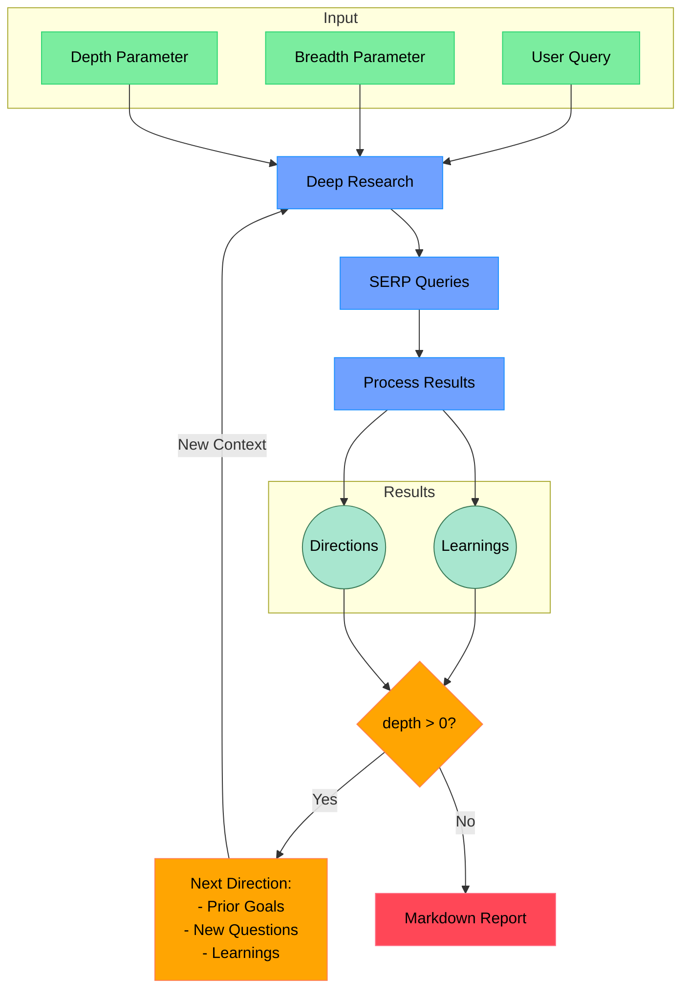

# Open Deep Research

An AI-powered research assistant that performs iterative, deep research on any topic by combining search engines, web scraping, and large language models.

The goal of this repo is to provide the simplest implementation of a deep research agent - e.g. an agent that can refine its research direction over time and deep dive into a topic. Goal is to keep the repo size at <500 LoC so it is easy to understand and build on top of.

If you like this project, please consider starring it and giving me a follow on [X/Twitter](https://x.com/dzhng). This project is created by [Duet](https://duet.so).

## How It Works



## Features

- **Iterative Research**: Performs deep research by iteratively generating search queries, processing results, and diving deeper based on findings
- **Intelligent Query Generation**: Uses LLMs to generate targeted search queries based on research goals and previous findings
- **Depth & Breadth Control**: Configurable parameters to control how wide (breadth) and deep (depth) the research goes
- **Smart Follow-up**: Generates follow-up questions to better understand research needs
- **Comprehensive Reports**: Produces detailed markdown reports with findings and sources
- **Concurrent Processing**: Handles multiple searches and result processing in parallel for efficiency

## Requirements

- Node.js environment
- Codex signed in with ChatGPT or Claude Code signed in with an eligible Claude subscription
- API keys are needed only for the optional Firecrawl/API workflows

## Setup

### Node.js (optional API mode)

1. Clone the repository
2. Install dependencies:

```bash
npm install
```

3. Set up environment variables in a `.env.local` file:

```bash
FIRECRAWL_KEY="your_firecrawl_key"
# If you want to use your self-hosted Firecrawl, add the following below:
# FIRECRAWL_BASE_URL="http://localhost:3002"

RESEARCH_PROVIDER="api"
SEARCH_PROVIDER="firecrawl"
OPENAI_KEY="your_openai_key"
```

To use local LLM, comment out `OPENAI_KEY` and instead uncomment `OPENAI_ENDPOINT` and `OPENAI_MODEL`:

- Set `OPENAI_ENDPOINT` to the address of your local server (eg."http://localhost:1234/v1")
- Set `OPENAI_MODEL` to the name of the model loaded in your local server.

### Docker

1. Clone the repository
2. Copy `.env.example` to `.env.local`, set `RESEARCH_PROVIDER="api"` and `SEARCH_PROVIDER="firecrawl"`, and set your API keys

3. Run `docker build -f Dockerfile`

4. Run the Docker image:

```bash
docker compose up -d
```

5. Execute `npm run docker` in the docker service:

```bash
docker exec -it deep-research npm run docker
```

## Research with a subscription (no API keys)

The default workflow uses Codex for live web search, source analysis, follow-up research, and report writing. Firecrawl is optional. Each step starts a separate session and returns validated JSON; this does not call an existing chat conversation.

1. Run `npm install`.
2. Install the current Codex CLI with `npm install -g @openai/codex`. Run `codex login` and choose **Sign in with ChatGPT**. The SDK includes its own CLI runtime and reuses the saved login.
3. Copy `.env.example` to `.env.local`. Keep `RESEARCH_PROVIDER="codex"` and `SEARCH_PROVIDER="agent"`. No API keys are needed.
4. Run `npm start` for interactive research or `npm run api` for the local HTTP service.

### Claude Code subscription

Install the current native Claude Code CLI using [Anthropic's installation instructions](https://code.claude.com/docs/en/setup), then run `claude auth login` with your Claude subscription account. Claude Code v2.1.248 or later is required for restricted mode; use the latest release for compatibility.

Set these values in `.env.local`:

```bash
RESEARCH_PROVIDER="claude-code"
SEARCH_PROVIDER="agent"
# Optional:
# CLAUDE_MODEL="sonnet"
# CLAUDE_PATH="absolute/path/to/claude"
# CLAUDE_TIMEOUT_MS="600000"
```

The application invokes the official `claude -p` CLI with structured output, using saved subscription login. It does not use the Anthropic API SDK, extract OAuth tokens, or forward credentials to another service. Before each request, it verifies first-party OAuth subscription authentication and refuses API or cloud-provider authentication. Claude Code's safe and restricted modes disable personal/project customizations; research sessions expose only WebSearch and WebFetch. Analysis and writing sessions expose no built-in tools. Bare mode is deliberately omitted because it requires API authentication.

Claude needs its own eligible subscription; your ChatGPT subscription does not cover Claude Code. Web-tool availability depends on your Claude account, region, and workspace policy. Sign-in, quota, permission, and malformed-response failures stop the run with no API fallback. Account-level extra usage or purchased credits can still apply in either product; this application does not change those billing settings.

### Research and source handling

Subscription calls are serialized, with a 10-minute timeout per call. `CODEX_TIMEOUT_MS` and `CLAUDE_TIMEOUT_MS` adjust the timeouts. `CODEX_MODEL` and `CLAUDE_MODEL` select models available to the corresponding account; `CODEX_PATH` and `CLAUDE_PATH` optionally select a native CLI executable. `RESEARCH_CONCURRENCY` controls research branch concurrency (default 1 for subscriptions); the older `FIRECRAWL_CONCURRENCY` variable remains supported.

In agent search mode, each branch performs live searches and returns findings with supporting HTTP(S) source URLs and follow-up questions. Source links remain attached to findings through recursive research and report generation. Codex sessions must emit a web-search event; unsupported or disabled search fails instead of producing a memory-only report. Codex uses a read-only sandbox with shell tools disabled and command networking disabled; its hosted web search is separate from command networking. Source URLs are model-returned citations, not an independent guarantee that every claim is correct; review sources for important decisions.

This is topic research, not a replacement for all of Firecrawl's capabilities. It does not promise full-page Markdown extraction or bulk website crawling.

### Optional Firecrawl and API modes

To retain Firecrawl for search and scraping while using either subscription backend for reasoning, set `SEARCH_PROVIDER="firecrawl"` and provide `FIRECRAWL_KEY` (or your self-hosted configuration). Firecrawl has separate limits and costs.

To use the original API model providers, explicitly set `RESEARCH_PROVIDER="api"`, `SEARCH_PROVIDER="firecrawl"`, and configure `OPENAI_KEY` or `FIREWORKS_KEY`. API mode also defaults to Firecrawl when `SEARCH_PROVIDER` is omitted. `SEARCH_PROVIDER="agent"` is unavailable in API mode. API calls are billed separately.

The original Docker image is intended for API mode: set both provider variables accordingly. Subscription mode is intended for a local machine where you can sign in. Never publish login credentials or place subscription credentials in public CI.

Validation: `npm run typecheck` and `npm test`. Tests mock CLI/model responses and consume no subscription usage.

Official documentation: [Codex web search](https://learn.chatgpt.com/docs/web-search), [Codex authentication](https://learn.chatgpt.com/docs/auth), [Claude Code CLI automation](https://code.claude.com/docs/en/headless), [Claude subscription access](https://support.claude.com/en/articles/11145838-use-claude-code-with-your-pro-or-max-plan).

## Usage

Run the research assistant:

```bash
npm start
```

You'll be prompted to:

1. Enter your research query
2. Specify research breadth (recommended: 3-10, default: 4)
3. Specify research depth (recommended: 1-5, default: 2)
4. Answer follow-up questions to refine the research direction

The system will then:

1. Generate and execute search queries
2. Process and analyze search results
3. Recursively explore deeper based on findings
4. Generate a comprehensive markdown report

The final report will be saved as `report.md` or `answer.md` in your working directory, depending on which modes you selected.

### Concurrency

If you have a paid version of Firecrawl or a local version, feel free to increase the `ConcurrencyLimit` by setting the `CONCURRENCY_LIMIT` environment variable so it runs faster.

If you have a free version, you may sometimes run into rate limit errors, you can reduce the limit to 1 (but it will run a lot slower).

### DeepSeek R1

Deep research performs great on R1! We use [Fireworks](http://fireworks.ai) as the main provider for the R1 model. To use R1, simply set a Fireworks API key:

```bash
FIREWORKS_KEY="api_key"
```

The system will automatically switch over to use R1 instead of `o3-mini` when the key is detected.

### Custom endpoints and models

There are 2 other optional env vars that lets you tweak the endpoint (for other OpenAI compatible APIs like OpenRouter or Gemini) as well as the model string.

```bash
OPENAI_ENDPOINT="custom_endpoint"
CUSTOM_MODEL="custom_model"
```

## How It Works

1. **Initial Setup**

   - Takes user query and research parameters (breadth & depth)
   - Generates follow-up questions to understand research needs better

2. **Deep Research Process**

   - Generates multiple SERP queries based on research goals
   - Processes search results to extract key learnings
   - Generates follow-up research directions

3. **Recursive Exploration**

   - If depth > 0, takes new research directions and continues exploration
   - Each iteration builds on previous learnings
   - Maintains context of research goals and findings

4. **Report Generation**
   - Compiles all findings into a comprehensive markdown report
   - Includes all sources and references
   - Organizes information in a clear, readable format
  
## Community implementations

**Python**: https://github.com/Finance-LLMs/deep-research-python

## License

MIT License - feel free to use and modify as needed.
